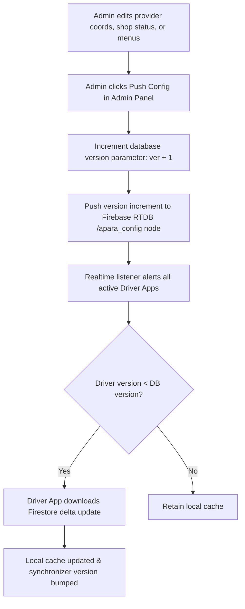

# 🛡️ Admin Control Engine & Platform Operations

## 1. Admin Control Dashboard Overview (`pages/admin.html`)
The **APARA Command Center** is a desktop-optimized, responsive control station designed to manage the entire highway emergency ecosystem. Adhering to the **Tactical Horizon** layout, it combines a dark background grid (`#101417` with $40\text{px}$ linear mesh lines) with neon-cyan (`#00f2ff`) and amber (`#ffdcc3`) accents.

---

## 2. Platform Analytics & Performance Monitoring
The dashboard aggregates real-time indicators to monitor the status and health of highway corridors.

### Core Metrics Grid
*   **Total Registered Drivers**: The count of driver accounts initialized via mobile login verification.
*   **Active Emergency Services**: The total number of registered hospitals, towing crews, and mechanics online.
*   **Active Incidents Feed**: The count of pending or active SOS tickets.
*   **Auto-Resolved Tickets**: The percentage of resolved emergencies compared to total alerts.

### Interactive Analytical Charts
The dashboard integrates **Chart.js** via CDN to render responsive canvas layouts:
1.  **SOS Category Distribution Chart (`chartCategory`)**: A Doughnut chart mapping the relative frequency of emergency types (e.g., severe collisions, towing requests, tyre puncture dispatches).
2.  **Incident Timeline Graph (`chartTimeline`)**: A Line graph showing emergency frequency and response times over 7-day rolling intervals.

---

## 3. Database Management & Tables
The Command Center displays interactive data grids with advanced filtering, column sorting, and full search capabilities.

### Admin Data Registries Table
| Registry View | Managed Entity | Key Fields Displayed | Action Capabilities |
|---|---|---|---|
| **Provider Table** | Registered Emergency Units | ID, Name, Phone, GPS, Corridor, Status (Active/Inactive) | Toggle Status, Delete Account, Edit Coordinates |
| **Shop Table** | Highway Marketplace Shops | ID, Name, Phone, GPS, Hours, Categories, Status | Status Switch, Edit Menu items count, Delete |
| **Drivers Table** | Registered Mobile Drivers | Phone, Vehicle Info, Last Active, Registered Date | View profile logs, Active Session Check |
| **Block Registry** | Auto-Generated 1km Blocks | Region, Block ID, Lat/Lng Center, Coordinates, Date Created | Export to JSON, Bulk Import Registry |
| **Transit Log** | Block Crossing Events | Driver ID, Block ID, Speed, Accuracy, Timestamp, Direction | View Speed logs, Export Transit History |
| **Audit Trails** | Complete SOS Event History | SOS ID, Block Code, Type, Priority, Coordinates, Status | Inspect Incident timeline, Export CSV Audit |

---

## 4. Bulk Data Backups (Import / Export)
To ensure system durability and support offline data transfers, the panel provides secure JSON and CSV backup pipelines:

### Export Pipeline
*   **JSON Data Export**: Converts internal memory registries (such as the Block Registry or Transit Log) into structured, indented JSON strings and triggers a client-side download:
    ```javascript
    const dataStr = "data:text/json;charset=utf-8," + encodeURIComponent(JSON.stringify(Store.getBlocks(), null, 2));
    const dlAnchor = document.createElement('a');
    dlAnchor.setAttribute("href", dataStr);
    dlAnchor.setAttribute("download", `apara_blocks_${Date.now()}.json`);
    dlAnchor.click();
    ```
*   **CSV Data Export**: Parses tabular registries (like the SOS Audit Trail) into CSV format, appending safe delimiters and triggering a download.

### Import Pipeline
*   **Structured JSON Import**: Dispatchers can upload JSON backup files to restore data. The file parser validates schema keys (e.g. checking for `blockId` and `lat` fields in block files) before merging the imported records into the local database, protecting against corrupt uploads.

---

## 5. Configuration Push Mechanism (`ConfigPush`)
The **Config Push Console** is the administrative control mechanism for system synchronization. It acts as the coordinator between database schemas, regional shops, and active drivers.



### Protocol Details
1.  **Version Increment**: Bumping the version creates a configuration log containing the active admin user's name, action timestamp, and the specific modification reason.
2.  **Bandwidth Optimization**: Instead of redownloading the entire database, the incremental version bump prompts the client-side driver app to fetch only the Firestore diffs of newly added, removed, or updated providers and shops. This preserves cellular data on remote highways.
3.  **Client-Side Invalidation**: Upon receiving the config push notification, the driver app immediately invalidates its local memory caches for the matching coordinates and triggers a fresh sync loop, ensuring safety data is always up to date.
