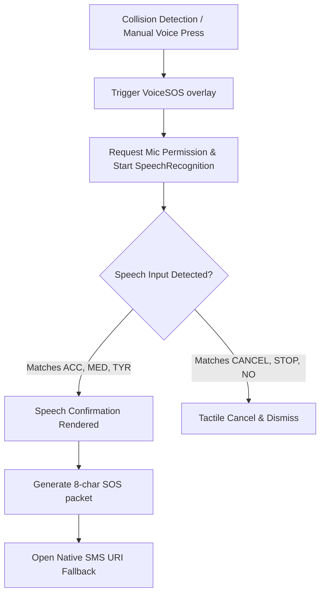

# 🏎️ Driver Telemetry HUD & Local Operations Engine

## 1. Overview & Visual Design System
The **APARA Driver Application** (`pages/driver.html`) is a mobile-first, high-fidelity HUD interface designed specifically for vehicle dashboards. It adheres to the **Tactical Horizon** design framework:
*   **Volumetric Spotlights**: Utilizes radial gradients peaking from the top-center (`rgba(0, 212, 255, 0.06)`) and orange glows on warning states (`rgba(249, 115, 22, 0.03)`).
*   **Glassmorphism Panels**: Telemetry cards are frosted elements constructed with background colors of `rgba(12, 18, 30, 0.6)`, structural borders of `rgba(255, 255, 255, 0.05)`, and a `backdrop-filter: blur(12px)` layer for background decoupling.
*   **Vibrant Accent States**: Glowing cyber-accents represent connection quality. Neon cyan (`#00e5ff`) indicates online sync capability, warm amber (`#fbbf24`) signals offline operation, and neon red (`#F87171`) alerts the driver to a stopped or critical hazard status.

---

## 2. HUD Telemetry Indicators & Real-Time Sensors
The central dashboard updates dynamically at a high frequency to display critical vehicle and GPS telemetry.

### Core Metrics Table
| Metric Gauge | Variable Source | Render Element | Styling Accents | Description |
|---|---|---|---|---|
| **Grid Block** | `state.currentBlockId` | `#mktBlockLabel` | `#00e5ff` / `#fbbf24` | Displays the active 1km grid sector identifier. |
| **Speed Gauge** | `state.lastKnownPos.speed` | `.speed-display` | `#fff` with blur drop | Renders instantaneous vehicle velocity (km/h). |
| **GPS Coordinates** | `state.lastKnownPos` | `.gps-coords` | `rgba(0, 212, 255, 0.8)` | Lat/Lng coordinates formatted to 5 decimal places. |
| **Connection Status**| `NetworkDetector.online` | `.status-strip` | Cyan vs. Amber banners | Banners indicate online Firestore link vs. offline cache sync. |

---

## 3. Shock Detection Engine
To automate accident detection in high-speed highway collisions, the app integrates a real-time shock sensor utilizing the browser’s **HTML5 Device Orientation and Motion API**.

### Mathematical Acceleration Formula
The engine monitors the device's three-dimensional acceleration vectors ($x, y, z$) including the forces of Earth's gravity:
$$\text{Total Acceleration } (a_{\text{total}}) = \sqrt{a_x^2 + a_y^2 + a_z^2}$$
To eliminate standard static gravity ($9.8\text{ m/s}^2$) and calculate the net force of the impact:
$$\text{Net Impact Force } (F_{\text{impact}}) = \left| a_{\text{total}} - 9.8 \right|$$

### Collision Threshold Configuration
*   **Shock Trigger Limit**: Set to $\ge 30\text{ m/s}^2$ (~3.06G) by default.
*   **De-bounce Cooldown**: Implements a strict $10,000\text{ms}$ cooldown barrier after any trigger event to prevent secondary noise triggers.
*   **Permission Requests**: Dynamically requests permission via `DeviceMotionEvent.requestPermission()` on modern iOS platforms.
*   **Vibration Pattern**: Triggers a powerful tactile haptic warning array on collision detection:
    ```javascript
    navigator.vibrate([200, 100, 200, 100, 400]);
    ```

---

## 4. Web Speech Voice SOS Controller
In high-stress emergency scenarios where manual touch inputs are impossible or unsafe, the app starts the **Web Speech API** Voice SOS controller inside an absolute modal overlay `#voiceSosOverlay`.

### Voice SOS Lifecycle


### Voice Commands Dictionary
The controller initiates `SpeechRecognition` targeted at the English-India (`en-IN`) locale and matches speech substrings against a strict local triage database:

| Spoken Phrase Substring | Emergency Category Code | Resolved Target | Description |
|---|---|---|---|
| `"1"`, `"one"`, `"hospital"`, `"accident"` | `ACC` | Accident SOS | Severe collision, vehicle damage, bodily trauma |
| `"2"`, `"two"`, `"mechanic"`, `"tow"` | `TOW` | Towing Request | Mechanical breakdown, engine failure |
| `"3"`, `"three"`, `"tyre"`, `"puncture"` | `TYR` | Tyre Triage | Deflated tyre, wheel replacement needed |
| `"fuel"`, `"petrol"`, `"diesel"` | `FUL` | Fuel Dispatch | Empty tank stranded on highway |
| `"0"`, `"cancel"`, `"stop"`, `"no"`, `"fine"` | `CANCEL` | Cancel/Aborted | False alarm dismissal sequence |

### Immediate Actions Sequence
Upon valid spoken category identification:
1.  **Stop listener**: Immediately halts the Web Speech recognition loop to free hardware resources.
2.  **Haptic confirm**: Vibrates the device using a sequence of `[100, 50, 300]`ms.
3.  **Find Nearest Provider**: Checks cached zones inside the `ZoneManager` database within a 10km radius, sorting by capability matching (e.g., matching medical to hospital, tire issues to punctures) and distance.
4.  **SMS Generation**: Assembles a detailed multi-line SMS payload:
    ```text
    APARA SOS [BlockCode8]
    [Icon] [Label]
    Loc: [Latitude],[Longitude]
    PIN: [ResolutionPin]
    Maps: https://maps.google.com/?q=[Latitude],[Longitude]
    ```
5.  **Target Redirection**: Launches the device's native messaging client via pre-filled SMS uri:
    `sms:[ProviderPhone]?body=[EncodedMessage]` (targeting the nearest provider, falling back to national emergency `112`).

---

## 5. Location Watchdog UI Integration
The **Location Watchdog** is actively bound to the interface via a dedicated countdown confirmation panel `#watchdogModal`.

*   **Tactile Prompts**: Periodically vibrates the device to grab attention during warnings.
*   **Stationary Warning mode**: Shows a customized layout (`🚗 ARE YOU PARKED?`) prompting the user to select `🅿️ STAY` (parking mode) or dismiss.
*   **Warning Countdown Modal**: Displays a large digital timer `#wdTimer`. If the timer hits zero without a user click, it automatically triggers a high-severity SOS event.
*   **Intensified Alert Haptics**: In the final $10\text{ seconds}$ of the hazard countdown, the system triggers steady haptic vibrations every second (`navigator.vibrate(300)`) to ensure the driver is alerted even if the phone is in a pocket.

---

## 6. Local Offline Storage Map (`localStorage`)
The driver app is a local-first system designed to function indefinitely without a database server connection. It stores all local logs, transit trails, and order receipts under predefined immutable keys.

### Core Offline Keys reference
```javascript
const STORE_KEYS = {
  ACTIVE_SESSION:   'apara_active_session',   // String: Active driver session UUID
  DRIVER_PROFILE:   'apara_driver_profile',   // Object: Signed-in driver phone & vehicle info
  LAST_KNOWN_POS:   'apara_last_known_pos',   // Object: Last successful coordinate, speed, & accuracy
  TRANSIT_QUEUE:    'apara_transit_queue',    // Array: Pending block transition records to sync
  SOS_EVENTS:       'apara_sos_events',       // Array: Log of all triggered emergency tickets
  ACTIVE_ORDER:     'apara_active_order',     // Object: Active food/item purchase packet and OTP
  ORDER_QUEUE:      'apara_order_queue',      // Array: Pending marketplace order logs
  APARA_SETTINGS:   'apara_settings',         // Object: Shock sensitivity & voice preference flags
  CONFIG_VERSION:   'apara_config_version',   // String: Active local configuration bundle version
};
```

---

## 7. Interactive HUD Proximity Map & Provider Visualization
The APARA Driver Application embeds an interactive **Leaflet-based HUD Map** (`#mktMap`) within its primary cockpit layout. This provides drivers with instant visual awareness of their immediate surroundings, plotting commercial shops and emergency service providers in real time.

### 7.1 Visual Color Code & Marker Taxonomy
To ensure immediate readability during high-speed transit or stressful emergencies, the map employs a strict color-coded marker system:

| Entity Type | Visual Representation | Code/Color | Description |
|---|---|---|---|
| **Driver (Self)** | Pulsing blue circle marker | `#3B82F6` (White border) | Represents the vehicle's real-time or estimated position. |
| **Visible Zone** | Green dotted radius boundary | `#10B981` (Opacity: 0.04) | Illustrates the standard $10\text{ km}$ proximity guard zone. |
| **Hospitals (`HOSP`)** | Large crimson diamond | `#EF4444` | Clinical centers equipped for bodily trauma/medical SOS. |
| **Pharmacies (`PHAR`)** | Deep purple diamond | `#A855F7` | First-aid suppliers and medication dispatch points. |
| **Mechanics (`MECH`)** | Bright orange diamond | `#F97316` | Mechanical repair and vehicle inspection shops. |
| **Towing (`TOW`)** | Neon yellow diamond | `#EAB308` | Flatbed towing operators for severe breakdowns. |
| **Fuel Delivery (`FUEL`)** | Cyber blue diamond | `#3B82F6` | Stranded vehicle emergency refuelling dispatches. |
| **Tyre Punctures (`PUNC`)**| Warm amber diamond | `#F59E0B` | Spot tyre replacements and mobile puncture repairers. |

### 7.2 Proximity Query & Fetching Pipeline
The map retrieves and displays active providers within the $10\text{ km}$ `MKT_DISPLAY_RADIUS` by executing a dual-stream proximity calculation:

1.  **Zone-Cached Discovery**: Loops through all locally cached Geographic Zones via `ZoneManager.getCachedZoneIds()`. For each active zone, it parses the `providers` array, filtering out any inactive responders.
2.  **Local Store Discovery**: Directly queries active provider objects loaded in memory from `Store.getProviders()`, parsing `p.gps` strings.
3.  **Haversine Filtering**: Computes exact geodesic distance using the Haversine formula:
    $$d = 2R \arcsin\left(\sqrt{\sin^2\left(\frac{\Delta \text{lat}}{2}\right) + \cos(\text{lat}_1)\cos(\text{lat}_2)\sin^2\left(\frac{\Delta \text{lng}}{2}\right)}\right)$$
    Responders with $d \le 10\text{ km}$ are plotted on the map.
4.  **Actionable Hotlinks**: Every emergency marker binds an interactive Leaflet Popup containing the provider's brand name, distance, category label, and a direct-dial action link (`tel:[phone]`) to allow immediate one-tap calling during breakdowns.

### 7.3 Race-Condition & Render Size Guards
Because the Leaflet canvas initializes within an absolute view overlay subject to tab transitions, standard rendering often results in broken or gray map tiles. The map engine implements double-guard systems to ensure absolute rendering stability:

*   **Height Enforcement**: Programmatically injects structural parameters (`height = 220px`, `minHeight = 220px`) on `#mktMap` prior to initiating the Leaflet map constructor.
*   **Triple Invalidation Loop**: Leverages `requestAnimationFrame` style timeouts to continually recalculate the Leaflet bounds at critical animation ticks:
    ```javascript
    setTimeout(() => { if (mktState.map) mktState.map.invalidateSize(); }, 100);
    setTimeout(() => { if (mktState.map) { mktState.map.invalidateSize(); mktState.map.setView([pos.lat, pos.lng], 12); } }, 400);
    setTimeout(() => { if (mktState.map) mktState.map.invalidateSize(); }, 800);
    ```

