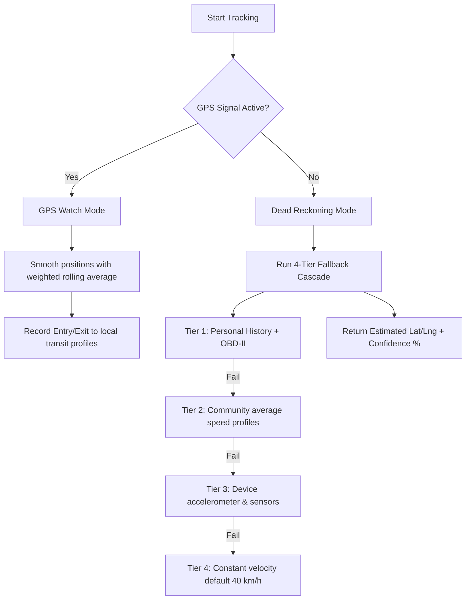
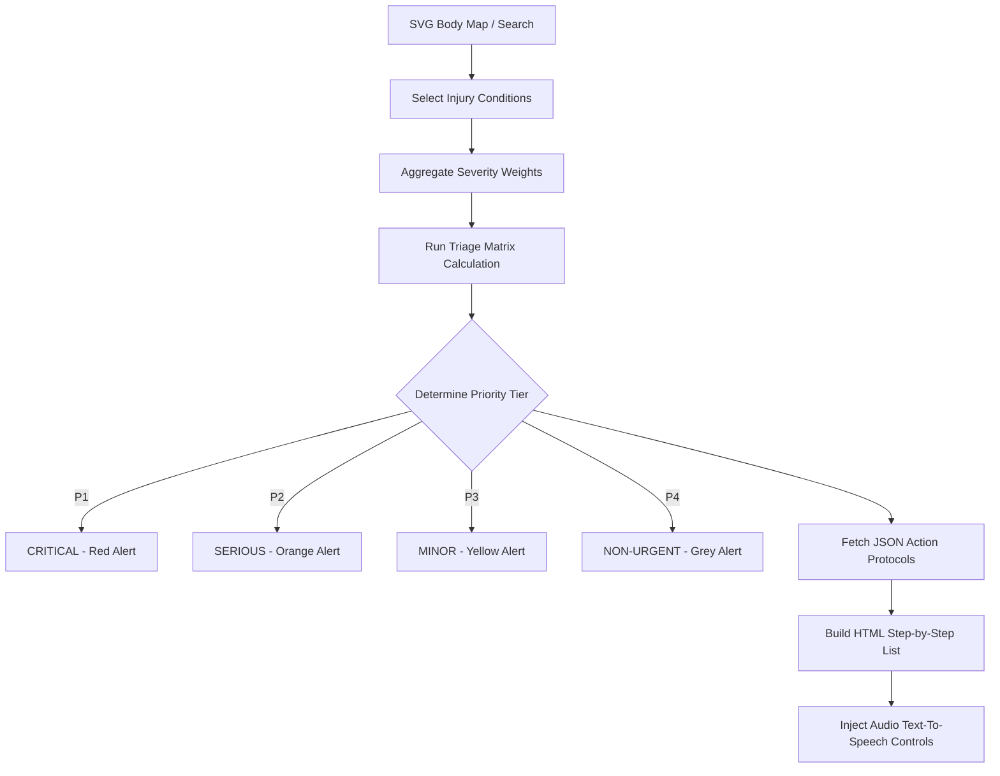
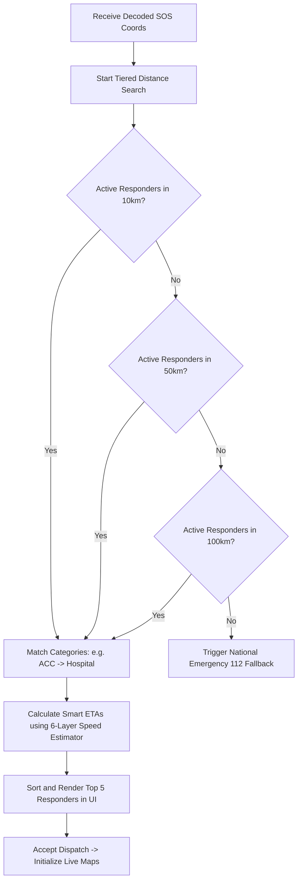
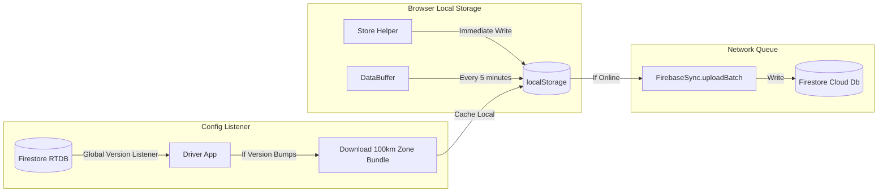

# 🌐 APARA Feature Architecture & Workflow Blueprint
> **Codename:** DRISHYTOX  
> **System Scope:** Highway Emergency Response with Offline-First Resiliency  
> **Target Audience:** Engineering Team & AI Coding Assistants  

This document serves as the absolute source of truth regarding the engineering architecture, internal logic pipelines, state machines, and data flow of APARA. Any agent continuing development on this system **must** read this blueprint to understand how the features are structured, why the workflows are designed this way, and how the components interact.

---

## 📋 Table of Contents
1. [Offline Block Code System](#1-offline-block-code-system)
2. [GPS Tracker & Dead Reckoning Engine](#2-gps-tracker--dead-reckoning-engine)
3. [Smart Location Watchdog (Automated Emergency Detection)](#3-smart-location-watchdog-automated-emergency-detection)
4. [Clinical Injury Triage & First-Aid Engine](#4-clinical-injury-triage--first-aid-engine)
5. [Tiered Service Provider Routing & Dispatch](#5-tiered-service-provider-routing--dispatch)
6. [Offline-First Store & Firebase Cost-Control Sync](#6-offline-first-store--firebase-cost-control-sync)

---

## 1. Offline Block Code System

### 1.1 What It Is & Why It Exists
The **Block Code System** is a compressed linear referencing system that translates standard 2D GPS coordinates (latitude and longitude) and emergency types into a high-density, human-readable alphanumeric code of **11 to 15 characters**.

On Indian highways, network coverage is highly intermittent. Traditional emergency services fail because they require a stable internet connection to render maps, fetch databases, or upload locations. 

The Block Code works under **zero-data conditions** because:
* It can be sent via **basic SMS** (fits inside <50 bytes).
* It can be transmitted via **voice call** (read over the phone to a responder).
* It can be written down on paper or shared via low-bandwidth interfaces like **USSD** or **LoRa**.

---

### 1.2 Architectural Architecture & Logic

```mermaid
graph TD
    subgraph Grid Math
        A[GPS Coordinates] --> B[Get Region Bucket]
        B --> C[Compute 10km grid cell]
        C --> D[Generate Base-36 Segment]
    end
    subgraph String Builder
        D --> E[Combine: Region + Segment]
        F[Emergency Type] --> G[Map to Type Code]
        H[Trigger Reason] --> I[Map to Suffix]
        E & G & I --> J[15-Character Block Code]
    end
```



#### The Coordinate Grid & Partitioning (India Grid)
India is partitioned into a **50-cell grid** spanning 10 latitude buckets and 5 longitude buckets.
* **Base Latitudes:** $8.0^\circ$ to $38.0^\circ$ (with a bucket size of $3.0^\circ$).
* **Base Longitudes:** $68.0^\circ$ to $98.0^\circ$ (with a bucket size of $6.0^\circ$).

This partitioning enables high-precision relative calculations within a localized grid:
$$\text{Row} = \lfloor \frac{\text{lat} - 8.0}{3} \rfloor, \quad \text{Col} = \lfloor \frac{\text{lng} - 68}{6} \rfloor$$

Within each cell:
* The system computes a **linear offset index** based on a $1\text{ km} \times 1\text{ km}$ sub-grid resolution.
* Coordinates are encoded using a Base-36 representation ($0\text{-}9, \text{A-Z}$) to preserve compression.

#### Code Formats and Structure
The system supports three progressive formats of increasing detail:

| Format Name | Template | Example | Size | Purpose |
|---|---|---|---|---|
| **Compact Code** | `BLOCK8` | `CE512ACC` | 8 chars | Ultra-compact voice transmission |
| **Standard Block Code** | `RR-NNN-TTT` | `MH-212-MED` | 10 chars | Basic offline SMS / physical writing |
| **Reason-Stamped Code** | `RR-NNN-TTT-SUFX` | `KL-105-ACC-STAT` | 15 chars | Telemetry-rich watchdog transmission |

* **`RR` (Region Prefix):** Matches a known highway corridor (e.g., `MH` = Maharashtra NH48, `JK` = Jammu & Kashmir NH44).
* **`NNN` (Block Index):** The sequential $1\text{ km}$ highway marker.
* **`TTT` (Type Code):** Three-letter emergency category (e.g., `ACC` = Accident, `MED` = Medical, `TYR` = Tyre).
* **`SUFX` (Reason Suffix):** Identifies how the code was generated (e.g., `GOFF` = GPS Off, `STAT` = Stationary, `MANU` = Manual).

---

### 1.3 Step-by-Step Execution Workflow

```
[Driver App]
1. Driver initiates SOS -> Fetches live GPS or Estimated Position.
2. Calls BlockCodeEncoder.encodeWithReason(lat, lng, type, reason).
3. Produces a 15-character string (e.g., "JK-042-ACC-GOFF").
4. Copies code to clipboard & pre-fills native SMS app.
       │
       ▼ (Transmission via SMS, voice call, or V2V relay)
       │
[Provider App]
5. Provider pastes/receives the raw code.
6. Calls BlockCodeEncoder.decodeWithReason(code).
7. Validates format -> Strips prefixes/suffixes.
8. Decodes base-36 values back into raw GPS coordinates.
9. Renders emergency marker + radius bounds on Leaflet Map.
```

---

### 1.4 Code Implementation Reference
* **File Location:** `c:\Users\anshul prajapati\OneDrive\Desktop\DRISHYTOX\js\block-code-encoder.js`
* **Core APIs:**
  * `BlockCodeEncoder.encode(lat, lng, type)`
  * `BlockCodeEncoder.decode(code)`
  * `BlockCodeEncoder.isValid(code)`
  * `BlockCodeEncoder.decodeWithReason(code)`

---

## 2. GPS Tracker & Dead Reckoning Engine

### 2.1 What It Is & Why It Exists
The **GPS Tracker** handles high-precision mobile tracking while driving. The **Dead Reckoning Engine** is the fallback mathematical processor that calculates driver location when GPS signal is completely lost (e.g., tunnels, mountain passes, dense forests).

Without this engine, if a driver enters a dead zone and crashes, the emergency system would have no way of knowing their location. With this engine, the app estimates their coordinates using speed telemetry, historical logs, and community averages.

---

### 2.2 Architectural Architecture & Logic



#### Jitter Filtering & Safety Bounds
Raw GPS signals are noisy, especially at high highway speeds. The GPS Tracker applies strict bounds:
* **Accuracy Threshold:** Reject any coordinate fix with an accuracy value $> 50\text{ meters}$.
* **Stationary Jitter Guard:** If distance movement is $< 3\text{ meters}$ within a $3\text{ second}$ window, speed is forced to $0\text{ km/h}$ to prevent position drift when parked.
* **Highway Speed Cap:** Rejects coordinate jumps representing speeds $> 200\text{ km/h}$ (interprets them as GPS jumps).

#### The 4-Tier Position Estimation Fallback
When network and GPS signals drop, `GPSTracker.getEstimatedPosition()` is called, using a fallback pipeline:

```
┌────────────────────────────────────────────────────────┐
│ TIER 1: PERSONAL CORRIDOR HISTORY                      │
│ - Uses driver's own recorded crossings for this block │
│ - Highest accuracy (Error: ±50m at 5 min)             │
└───────────────────────────┬────────────────────────────┘
                            ▼ (If no personal history)
┌────────────────────────────────────────────────────────┐
│ TIER 2: COMMUNITY SPEED PROFILES                       │
│ - Fetches compiled highway speed profiles from others │
│ - High accuracy (Error: ±100m at 5 min)            │
└───────────────────────────┬────────────────────────────┘
                            ▼ (If no community profiles)
┌────────────────────────────────────────────────────────┐
│ TIER 3: DEVICE TELEMETRY & ACCELEROMETER               │
│ - Integrates device accelerometer + compass heading    │
│ - Moderate accuracy (Error: ±200m at 5 min)           │
└───────────────────────────┬────────────────────────────┘
                            ▼ (If sensor data is restricted)
┌────────────────────────────────────────────────────────┐
│ TIER 4: CONSTANT VELOCITY ESTIMATION                   │
│ - Integrates last known speed * elapsed time           │
│ - Standard fallback (Error: ±400m at 5 min)           │
└────────────────────────────────────────────────────────┘
```

---

### 2.3 Step-by-Step Execution Workflow
1. Driver logs into the mobile app and starts moving.
2. `GPSTracker` streams GPS logs and updates the rolling speed buffer.
3. Every time a $1\text{ km}$ block boundary is crossed:
   * Writes block entry/exit transit profiles to `localStorage` under `apara_zone_history`.
4. If signal is lost:
   * `NetworkDetector` shifts system state to `OFFLINE`.
   * An interval starts polling `getEstimatedPosition()` every $2\text{ seconds}$.
   * Position updates dynamically on screen and the confidence indicator visually degrades.
5. On signal restoration:
   * `OfflineRetroGenerator` computes the offline path and generates intermediate blocks retrospectively.
   * Flushes records to the background sync queue.

---

### 2.4 Code Implementation Reference
* **File Location:** `c:\Users\anshul prajapati\OneDrive\Desktop\DRISHYTOX\js\data.js`
* **Core APIs:**
  * `GPSTracker.start()` / `GPSTracker.stop()`
  * `GPSTracker.getEstimatedPosition()`
  * `DeadZoneHistory.recordEntry()` / `DeadZoneHistory.recordExit()`
  * `OfflineRetroGenerator.retroGenerateBlocks()`

---

## 3. Smart Location Watchdog (Automated Emergency Detection)

### 3.1 What It Is & Why It Exists
The **Location Watchdog** is an background monitor running in the driver's application. It actively tracks safety anomalies: **GPS Loss** (indicating possible device tampering or deep blockages) and **Prolonged Stationary States** (indicating a potential high-impact crash or breakdown where the driver is incapacitated).

If a driver crashes on a remote highway, they may become unconscious. The Watchdog serves as a virtual passenger, automatically sending a distress SMS with telemetry coordinates if the driver fails to respond to safety warnings.

---

### 3.2 Architectural State Machine & Logic

```
                    ┌────────────────────────┐
                    │        DRIVING         │
                    └───────────┬────────────┘
                                │
        ┌───────────────────────┴───────────────────────┐
        ▼ (No movement >50m / 5 min)                    ▼ (GPS Lost for >5 min)
┌───────────────────────────────┐               ┌───────────────────────────────┐
│      STATIONARY_WARNING       │               │        GPS_OFF_WARNING        │
│   (1-min countdown modal)     │               │    (1-min countdown modal)     │
└───────────┬───────────────┬───┘               └───────────┬───────────────┬───┘
            │               │                               │               │
  [STAY]    │       [NO]    │  (Timer Expires)    [I'M OK]  │       [NO]    │  (Timer Expires)
  Pressed   │      Pressed  │  or Crashed         Pressed   │      Pressed  │  or Crashed
            ▼               ▼                               ▼               ▼
    ┌───────────┐     ┌───────────┐                   ┌───────────┐   ┌───────────┐
    │  PARKED   │     │ AUTO_SOS  │                   │  DRIVING  │   │ AUTO_SOS  │
    └───────────┘     └───────────┘                   └───────────┘   └───────────┘
```

#### Warning Modal Execution
* The watchdog works via **non-intrusive warning modals** with distinct mechanical alert sounds.
* Modals display a **1-minute countdown timer** visually mapped as a shrinking radial border.
* Tapping **[I'M OK / STAY]** immediately resets watchdog timers.
* Tapping **[NO - SEND SOS]** or **allowing the timer to expire** triggers the automated rescue sequence.

---

### 3.3 Step-by-Step Execution Workflow
1. Driver signs in. The initialization routine boots `LocationWatchdog.init()`.
2. Every $10\text{ seconds}$, a safety heartbeat scans GPS data:
   * **Test 1:** Is the speed $0\text{ km/h}$ and position delta $< 50\text{ meters}$ for $5\text{ minutes}$?
   * **Test 2:** Has the GPS connection returned a terminal hardware error for $5\text{ minutes}$?
3. If either test fails:
   * The system shows the warning modal on screen and triggers a structural alert sound.
4. If the user touches `I'M OK` or `STAY`:
   * The watchdog resets the timer. If marked as `PARKED`, it halts checking until speed exceeds $>10\text{ km/h}$.
5. If the timer hits $0$:
   * Triggers `triggerAutoSOS()`.
   * Extracts the last known coordinates or dead-reckoning estimations.
   * Encodes a 15-character block code with suffix `STAT` or `GOFF`.
   * Automatically executes a native SMS redirect to the nearest emergency provider.

---

### 3.4 Code Implementation Reference
* **File Location:** `c:\Users\anshul prajapati\OneDrive\Desktop\DRISHYTOX\js\location-watchdog.js`
* **Core APIs:**
  * `LocationWatchdog.init()`
  * `LocationWatchdog.checkStationary()`
  * `LocationWatchdog.checkGPSState()`
  * `LocationWatchdog.triggerAutoSOS()`

---

## 4. Clinical Injury Triage & First-Aid Engine

### 4.1 What It Is & Why It Exists
The **Triage & First-Aid Engine** is an integrated interactive helper that maps driver-selected injury configurations directly to standardized medical priority tiers (P1 to P4) and generates dynamic, step-by-step first-aid protocols with Text-to-Speech (TTS) guidance.

During highway accidents, panic leads to incorrect medical actions (e.g., moving a patient with a suspected spinal injury, choking during CPR). This engine provides structured, verified first-aid protocols, ensuring that the driver or bystanders do no harm while rescuers are in transit.

---

### 4.2 Architectural Architecture & Logic



#### The Triage Matrix Calculation
Each condition in `road_sos_system.json` is assigned a base clinical severity score ($1\text{ to }10$):

$$\text{Severity Score} = \text{Base Weight} \times \text{Multiplier (Pain Level + Shock State)}$$

* **P1 (Red Alert - Critical):** Score $\ge 8$. Life-threatening issues (e.g., Arterial Bleeding, Cardiac Arrest, Head Trauma).
* **P2 (Orange Alert - Serious):** Score $5\text{-}7$. Major issues needing urgent care (e.g., Open Fracture, Deep Laceration).
* **P3 (Yellow Alert - Minor):** Score $3\text{-}4$. Non-life-threatening (e.g., Closed Fracture, Mild Heat Stroke).
* **P4 (Grey Alert - Non-Urgent):** Score $< 3$. Simple injuries (e.g., Minor Bruise, Sprain).

---

### 4.3 Step-by-Step Execution Workflow

```
[Screen 1: Activation]
Tapping 🚨 SOS on driver app launches the Road SOS interface.
      │
      ▼
[Screen 2: Selector]
Displays interactive front/back SVG Body Map + 22 condition cards.
Driver taps a region -> chips filter available conditions.
User selects one or multiple conditions (e.g., Fracture + Bleeding).
      │
      ▼
[Screen 3: Assessment]
Dynamic follow-up assessment is displayed.
Requests Pain Scale (1-10) and flags (Unconscious? Breathing? Active Bleeding?).
      │
      ▼
[Screen 4: Triage Verdict]
Runs calculations -> Renders P1-P4 banner.
Generates local SOS code (e.g., "MH-241-MED").
Offers multi-provider SMS picker based on local zone caches.
      │
      ▼
[Screen 5: Guidance]
Pulls the precise first-aid actions from road_sos_system.json.
Provides active step timers (e.g., "Apply pressure for 5 minutes").
Enables TTS voice guidance so the user can listen hands-free.
```

---

### 4.4 Code Implementation Reference
* **File Locations:**
  * UI Markup: `c:\Users\anshul prajapati\OneDrive\Desktop\DRISHYTOX\pages\road-sos.html`
  * Logical Processor: `c:\Users\anshul prajapati\OneDrive\Desktop\DRISHYTOX\js\sos-protocols.js`
  * JSON Protocols: `c:\Users\anshul prajapati\OneDrive\Desktop\DRISHYTOX\road_sos_system.json`

---

## 5. Tiered Service Provider Routing & Dispatch

### 5.1 What It Is & Why It Exists
The **Routing & Dispatch Engine** is the provider-side core matching logic. It automatically intercepts decoded SOS signals, runs geospatial algorithms to match the emergency type with relevant providers, and establishes live tracking of responders.

If a driver has a tyre puncture, dispatching a cardiac ambulance is a waste of emergency resources. This engine matches the distress type with the closest, most appropriate responder type, scaling the search radius dynamically if no local matches are found.

---

### 5.2 Architectural Architecture & Logic



#### 6-Layer Speed Estimation Cascade
To provide realistic ETAs, the system avoids using a flat $40\text{ km/h}$ average, cascading through 6 data layers:

| Layer | Source | Details | Confidence |
|---|---|---|---|
| **Layer 1** | Live GPS Speed | Active telemetry of the vehicle | $95\%$ |
| **Layer 2** | Block History | Average speed of this driver in this specific block | $80\%$ |
| **Layer 3** | Entry Speed | Velocity when crossing into the block | $75\%$ |
| **Layer 4** | Community Profile | Compiled historical averages from all drivers (from Firebase) | $65\%$ |
| **Layer 5** | Driver Average | General average speed across all highway runs | $50\%$ |
| **Layer 6** | Global Default | Fallback velocity constant ($40\text{ km/h}$) | $20\%$ |

---

### 5.3 Step-by-Step Execution Workflow
1. SOS code is received by a provider.
2. The provider's app decodes the packet using `BlockCodeEncoder.decodeWithReason()`.
3. Geospatial engine computes matching candidates:
   * **Tiered Radius:** $10\text{ km} \rightarrow 50\text{ km} \rightarrow 100\text{ km}$ boundary expansions.
   * **Category Scoring:** Mechanics and tyre shops are deprioritized for clinical medical emergencies.
4. UI renders the matched candidates with Smart ETAs.
5. The provider taps `Accept & Dispatch`:
   * Map initializes using Leaflet inside the tab viewport.
   * `watchPosition` starts tracing the provider's coordinates.
   * Map dynamically re-bounds to show both the emergency marker (red target) and the provider's live position (pulsing blue dot).
6. Provider arrives at the scene:
   * Asks the driver for their deterministic **4-digit PIN**.
   * Enters PIN into provider console. If valid, the system marks the incident as `RESOLVED` in the store and flushes the data.

---

### 5.4 Code Implementation Reference
* **File Locations:**
  * Provider Dashboard: `c:\Users\anshul prajapati\OneDrive\Desktop\DRISHYTOX\pages\provider.html`
  * Logical Processor: `c:\Users\anshul prajapati\OneDrive\Desktop\DRISHYTOX\js\sos-provider-engine.js`

---

### 5.5 Driver-Side Proximity Visualization (Active SOS Mapping)
In addition to automated triage calculations and SMS generation, the APARA driver client integrates a real-time **Leaflet-based HUD Proximity Map** (`#mktMap`) directly within the cockpit marketplace page. This allows drivers to visually pinpoint nearby emergency responders and storefronts within a $10\text{ km}$ radius.

#### Proximity Matching & Rendering Pipeline
1.  **Driver Position Tracking**: Uses `state.lastKnownPos` to center the map viewport and render a high-visibility pulsing blue circle.
2.  **Dual proximity lookup**:
    *   **Commercial Shops**: Fetches active shops from the static registry and local zones within $10\text{ km}$. Markers are color-coded based on category (green family).
    *   **Emergency Providers**: Searches the local geographic zone cache (`ZoneManager`) and `Store.getProviders()` for active responders (Hospitals, Mechanics, Tow Services) within the $10\text{ km}$ Haversine distance threshold.
3.  **Visual Distinction (Taxonomy)**:
    *   Responders are rendered as larger circle markers with a white border.
    *   Responders use distinct red/orange/yellow colors from a priority scheme (e.g., `HOSP` = Crimson Red `#EF4444`, `MECH` = Vibrant Orange `#F97316`).
4.  **Instant Direct-Dial Popups**: Tapping a provider marker displays an active direct phone dial anchor (`tel:[Phone]`), giving drivers a physical fallback to verbally describe emergencies if automated data dispatching fails.

---

## 6. Offline-First Store & Firebase Cost-Control Sync

### 6.1 What It Is & Why It Exists
This is the database and sync backbone of the entire application. It integrates local browser storage (`localStorage`) as the absolute single-source-of-truth, with a highly optimized Firebase background sync protocol.

APARA is designed to serve hundreds of thousands of drivers while operating entirely within the **Firebase Free Tier**. To prevent cost overruns and ensure offline reliability:
* Data reads/writes are strictly minimized.
* Heavy polling is completely eliminated.
* All telemetry is buffered locally and synced in bulk batches.

---

### 6.2 Architectural Architecture & Data Flow



#### Cost-Control Optimizations
1. **Zone Bundles:** Instead of running live geohash queries against Firestore during an emergency, the driver app downloads all providers within a $100\text{ km}$ radius **once** upon login and caches them.
2. **Global Config Versioning:** The driver app does not query Firestore to check for data updates. It listens to a single value in the Firebase Realtime Database (`apara_config_version`). If this integer increases, the driver app triggers a background update.
3. **Immutable 5-Minute Buffering:** GPS coordinates and transits are not written to the database continuously. They are written to a memory array (`DataBuffer`) and flushed to `localStorage` every $5\text{ minutes}$. This buffer is uploaded to the cloud in a single bulk batch every $15\text{ days}$.

---

### 6.3 Step-by-Step Execution Workflow
1. Driver registers or logs into `driver.html`.
2. App reads current coordinates and calls `FirebaseSync.initDriverZone(lat, lng)`.
3. Downloads the static $100\text{ km}$ provider matrix and saves it to `apara_providers`.
4. Initializes a listener on Realtime Database `config/apara_config_version`.
5. Driver drives:
   * Block transits are recorded locally in `localStorage` under `apara_block_transit_log`.
   * No active database writes occur.
6. Driver closes the app or goes offline:
   * Buffer is immediately flushed to `localStorage`.
7. App returns online:
   * Background queue checks for pending batches.
   * Uploads compressed telemetry records to Firestore under `batch_uploads`.

---

### 6.4 Code Implementation Reference
* **File Locations:**
  * Shared Store & Utilities: `c:\Users\anshul prajapati\OneDrive\Desktop\DRISHYTOX\js\data.js`
  * Driver Sync Engine: `c:\Users\anshul prajapati\OneDrive\Desktop\DRISHYTOX\js\firebase.js`
  * Provider/Admin Sync Engine: `c:\Users\anshul prajapati\OneDrive\Desktop\DRISHYTOX\js\firebase_v2.js`
* **Core APIs:**
  * `Store.get(key)` / `Store.set(key, val)`
  * `DataBuffer.bufferBlock()` / `DataBuffer.flush()`
  * `FirebaseSync.initDriverZone(lat, lng)`
  * `FirebaseSync.pushProvider()` / `FirebaseSync.pushShop()`

---

## 7. Advanced Cockpit Subsystems (OBD-II, Voice SOS, Wake Lock, Retro-Gen)

To ensure high reliability under severe highway conditions, the APARA driver cockpit implements several low-level auxiliary systems.

### 7.1 ACC Triggered Fullscreen Voice Assistant (`VoiceSOS`)
*   **Hardware Accelerator Listener**: Listens to device accelerometer shock events to automatically launch a fullscreen HUD overlay (`#voiceSosOverlay`).
*   **Web Speech Recognition Engine**: Bootstraps Speech Recognition optimized for the `en-IN` (English-India) dialect. Listens continuously, auto-restarting if interrupted, and matches voice inputs against a fuzzy dictionary (`1` = Accident, `2` = Tow, `3` = Tyre/Fuel, `cancel` = False Alarm).
*   **Direct SMS Dispatch**: If voice matching succeeds, the engine fetches coordinates, generates an 8-character block code, resolves the nearest provider, and launches the native SMS draft draft (`sms:phone?body=...`) for one-tap voice-to-SMS rescue request.

### 7.2 OBD-II Web Bluetooth Integration
*   **GATT Profile Pairing**: Driver can pair their mobile device with a physical Bluetooth OBD-II scanner.
*   **Telemetry Overrides**: Pulls real-time velocity directly from the vehicle ECU, overriding standard browser GPS speed tracking, which prevents dead-reckoning errors in mountain passes and tunnels.

### 7.3 Screen Wake Lock API Safeguard
*   **Continuous Wake State**: Acquires system-level sleep prevention lock to stop the device screen from shutting down while driving, preserving GPS tracing in active highway zones.
*   **Visibility Lock Restoration**: Visibility event listener (`visibilitychange`) automatically re-acquires the wake lock on foreground restore and runs `.invalidateSize()` on the map canvas to maintain layout consistency.

### 7.4 GPS Retro-Generation (`OfflineRetroGenerator`)
*   **Blackout Recovery Loop**: When network signal or GPS returns after a blackout transit, the engine compares recovery coordinates with the last known offline position.
*   **Path Reconstruction**: If physical distance exceeded $1000\text{ m}$ (grid scale) and elapsed duration exceeded $10\text{ s}$, the generator performs linear vector projection to interpolate intermediate physical block crossings and retro-actively injects `BlockTransitLog` entry/exit records to preserve data profiling.

---

## 🛠️ Summary of Critical Architectural Constraints
When writing code for any of these features, you **must not** violate these rules:

> [!IMPORTANT]
> **Firebase Cost Guardrail:** Never add real-time active Firestore listeners (`onSnapshot`) on the driver side. All drivers must download zone data **once** and rely on local calculations.

> [!WARNING]
> **Temporal Dead Zone:** In all HTML pages, the bootstrapping Javascript IIFE must be declared *after* all variable and class declarations to prevent rendering blocks on mobile browsers.

> [!CAUTION]
> **Zero Network Dependency:** The SOS parsing, block code encoding, and clinical injury calculations must be completely self-contained in pure vanilla JS. They must never make network fetch requests.
